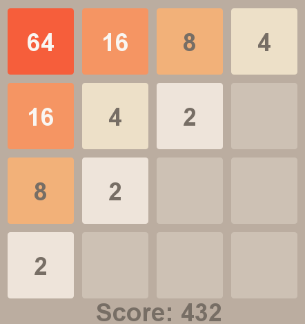

# 🧠 2048 Game in Java

🎮 Klon gry 2048 napisany w czystej Javie, oparty na kursie CodeGym — z kolorową grafiką, pełną funkcjonalnością, trybem auto-ruchu i losowego ruchu.

## 📌 Funkcje

- ✅ Pełna logika gry 2048 (łączenie kafelków, zarządzanie ruchem, reset gry)
- 🎨 Graficzny interfejs użytkownika z kolorowymi kafelkami
- 🔀 **Tryb losowego ruchu** (naciśnij `R`)
- 🤖 **Tryb automatycznego ruchu** (naciśnij `A`)
- ⌨️ Obsługa klawiatury (`↑`, `↓`, `←`, `→`, `R`, `A`, `ESC`)
- 🧪 Stabilna logika i dobre praktyki OOP (zgodne z kursem CodeGym)

## 🖥️ Screenshot



## 🚀 Jak uruchomić

### 1. Klonuj repozytorium

```bash
git clone https://github.com/twoj-nick/2048-java.git
cd 2048-java
```
